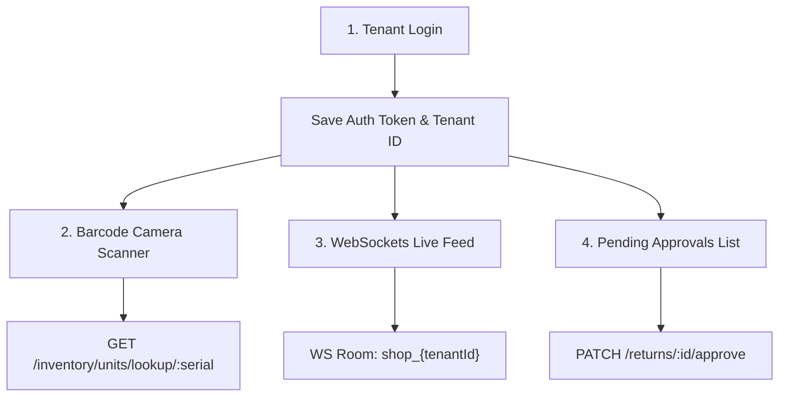

# TechBill Mobile — Minimum Viable Product (MVP) Plan

## 1. Objectives & Scope Boundaries

The purpose of the TechBill Mobile MVP is to deliver a functional mobile companion app for **Store Owners** and **Floor Sales Reps** with minimal complexity, validating the two primary technical risks:
1. **Camera-based barcode scanning** speed and serial number lookup.
2. **WebSocket connection resilience** and real-time state synchronization over cellular data.

### 1.1 In-Scope (MVP Core)
*   **Authentication**: Login via username/password + Tenant Slug. Persistent token storage.
*   **Camera Barcode Scanner**: Scan barcode/QR serial numbers to trigger hotpath lookup.
*   **Serial Number Details**: Display stock state, warranty details, pricing, and specs.
*   **Owner Live Dashboard**: Real-time sales ticker, transaction counts, low stock events feed, and the Groq AI Daily Summary.
*   **Return Approvals**: View pending returns, screen suspicious customer flags, and approve/reject returns.

### 1.2 Out-of-Scope (Post-MVP Phase 2)
*   **Offline Selling & Sync**: Standard offline operations (wait for SQLite synchronization engine).
*   **Bulk GRN Scanning**: Uploading bulk CSV/manifests from mobile (restrict to single unit scanning for MVP).
*   **Worker & User Management**: Adding, editing, or suspending workers (rely on web interface).
*   **Receipt Printing**: Bluetooth thermal printer drivers (use native PDF sharing/WhatsApp sharing instead).
*   **Biometrics (FaceID)**: Can be added in later updates.

---

## 2. MVP Features Spec & Technical Strategy



### 2.1 Feature 1: Multi-Tenant Login
*   **UI/UX**: Clean dark glassmorphic card with fields for `Tenant Slug`, `Username`, and `Password`.
*   **Implementation**:
    *   Construct URL based on slug: `https://{tenant-slug}.techbill.app/api/auth/login` or hit a central endpoint with `tenantSlug` in the body payload to obtain the tenant ID.
    *   Store JWT securely in the device Keychain using `expo-secure-store`.
    *   Persist the current user structure in a Zustand state store (`authStore`).

### 2.2 Feature 2: Camera Scanner & Lookup
*   **UI/UX**: Overlay view displaying a scanning reticle. Haptic feedback on detection. Custom modal showing product card results.
*   **Implementation**:
    *   Use `expo-camera` or `react-native-vision-camera`.
    *   On code read, throttle incoming reads (`500ms` lock) to prevent double scans.
    *   Call `GET /inventory/units/lookup/:serial` on the NestJS backend.
    *   Render the unit card: Name, SKU, Status (`in_stock`, `sold`, `returned`, etc.), Warranty End Date, and Price.

### 2.3 Feature 3: Live Sales Feed & WS Gateway
*   **UI/UX**: Glowing indicator badge indicating "Live". A vertically scrolling list showing recent sales cards.
*   **Implementation**:
    *   Connect to `techbill-api` Socket.IO gateway.
    *   On connection, emit `subscribe` event passing `{ tenantId }`.
    *   Listen to event `sale_created` and prepend the new transaction details into the dashboard state.
    *   Listen to event `low_stock_alert` and show a banner warning.

### 2.4 Feature 4: Return Approvals Portal
*   **UI/UX**: Tab bar badge with pending count. Details cards displaying "Return Reason" and "Suspicious Customer Check" (e.g. Red Warning if client has $>2$ returns in 30 days).
*   **Implementation**:
    *   Call `GET /returns` filtering for `status: 'pending'`.
    *   Action buttons: Approve (`PATCH /returns/:id/approve`) and Reject (`PATCH /returns/:id/reject`).

---

## 3. Technology Stack & Packages

| Category | Library Selected | Reason for Selection |
| :--- | :--- | :--- |
| **Framework** | Expo (React Native) | Matches existing React skills, cross-platform, fast setup. |
| **Styling** | NativeWind (v4) | Tailwind CSS consistency with `techbill-pos`. |
| **State** | Zustand | Light-weight, easy local persistence hooks. |
| **API Client** | Axios / TanStack Query | Cached REST query hooks, request interceptors for JWT. |
| **Real-time** | `socket.io-client` | Out-of-the-box support for NestJS gateway adapter. |
| **Hardware** | `expo-camera` | Simple setup, good scanning performance for core bar/QR codes. |
| **Secure Storage**| `expo-secure-store` | Encrypted Keychain storage for access tokens. |

---

## 4. MVP Execution Roadmap & Phases

```
┌────────────────────────────────────────────────────────┐
│ Phase 1: Dev Environment & Auth Scaffolding (Days 1-3)  │
└──────────────────────────┬─────────────────────────────┘
                           ▼
┌────────────────────────────────────────────────────────┐
│ Phase 2: Camera Scanner & Lookup Integration (Days 4-7)│
└──────────────────────────┬─────────────────────────────┘
                           ▼
┌────────────────────────────────────────────────────────┐
│ Phase 3: Real-Time Websocket Sales Feed (Days 8-10)    │
└──────────────────────────┬─────────────────────────────┘
                           ▼
┌────────────────────────────────────────────────────────┐
│ Phase 4: Owner Return Approvals Engine (Days 11-13)   │
└──────────────────────────┬─────────────────────────────┘
                           ▼
┌────────────────────────────────────────────────────────┐
│ Phase 5: Verification & Beta Test Build (Days 14-15)   │
└────────────────────────────────────────────────────────┘
```

*   **Milestone 1**: Login & Authenticated REST communication functional.
*   **Milestone 2**: Floor scanner parses serial barcodes and renders lookup details.
*   **Milestone 3**: WebSockets sync live feed of checkout activities.
*   **Milestone 4**: Internal Ad-Hoc/TestFlight beta deployment.

---

## 5. QA & Verification Strategy

### 5.1 Verification Commands & Tools
*   **Environment Scaffolding**: Setup verification via Expo CLI diagnostics:
    ```bash
    npx expo doctor
    ```
*   **Local Dev Server**: Launch bundling server:
    ```bash
    npx expo start
    ```

### 5.2 Manual Testing Checklist
1. **Auth Sandbox**: Attempt invalid credentials, correct credentials with matching tenant slugs. Verify session recovery on app restart.
2. **Scanner Lookup Test**: Scan mock UPC codes, Code 128 barcode samples, and QR codes. Verify response values match mock records in Supabase.
3. **Real-Time WebSockets Test**: Trigger a checkout from the web app client POS and verify that the Mobile app dashboard instantly flashes the new transaction event.
4. **Approval Cycle Test**: Submit return request from web POS, verify push/badge count updates in mobile, trigger mobile approval, verify that web inventory status changes in real-time.
