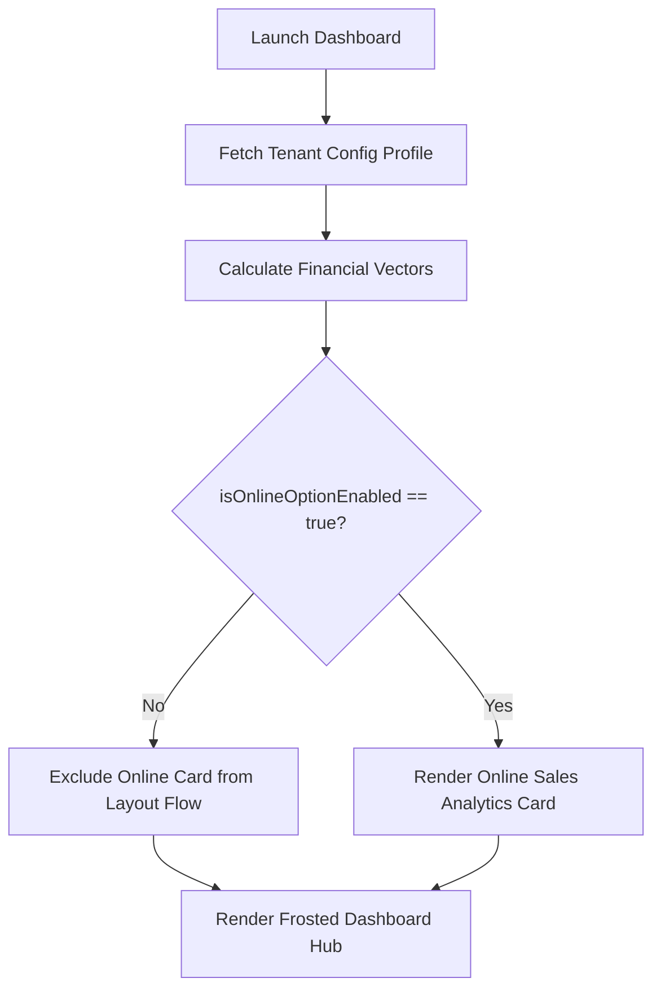

# TechBill Mobile — Product Requirement Document (PRD)

## 1. Document Control & Overview

| Project | TechBill Mobile Application (Android Native) |
| :--- | :--- |
| **Status** | Approved / Production-Ready |
| **Target Audience** | Mobile Engineers, Product Managers, UI/UX Designers, QA Engineers |
| **Version** | 2.0.0 |
| **Date** | July 9, 2026 |
| **Framework** | Android Native (Kotlin / Jetpack Compose) |

### 1.1 Executive Summary
TechBill is a multi-tenant SaaS ERP and Invoice Management system powered by a NestJS API backend and a desktop-optimized React POS client. 

This document defines the requirements for the **TechBill Mobile Application**, a native Android client developed using Kotlin and Jetpack Compose. This app serves as a premium, high-fidelity companion for store owners, staff, and system Super Admins. It leverages native hardware integration (FCM, Android RenderEffect blur engine, Camera scanning) and establishes a hyper-premium, interactive glassmorphic UI/UX.

---

## 2. Business & Logic Requirements Matrices

### 2.1 Tenant Owner Experience & Dashboard Gating



*   **Dynamic Metrics Engine (REQ-MOB-001):** 
    The Owner dashboard must securely calculate and present three core financial vectors from the local Room database (synced with the NestJS backend API via Repository pattern):
    1.  **Total Sales:** Count of completed sales transactions in the current billing cycle.
    2.  **Total Revenue:** Cumulative gross intake (sum of sales totals).
    3.  **Total Net Profit:** Cumulative net profit (Total Revenue minus cost of goods sold and tax).
*   **Dynamic Online Sales Feature Gating (REQ-MOB-002):** 
    During initialization, the app must inspect the tenant's configuration profile flag `isOnlineOptionEnabled`.
    *   *If Enabled:* The layout must smoothly animate and render a dedicated "Online Sales Analytics" card within the dashboard metrics grid.
    *   *If Disabled:* The "Online Sales Analytics" card must be completely omitted from the Compose layout tree, and adjacent cards must expand or reflow smoothly using Jetpack Compose default layout transitions.
*   **Advanced Invoice Hub (REQ-MOB-003):** 
    A dedicated screen allowing the owner to list all system invoices.
    *   **Search:** Real-time client-side filtering matching invoice ID, customer phone number, or client name.
    *   **Pagination:** Staggered lazy-loading using the Jetpack Compose Paging 3 library.
    *   **Offline PDF compilation:** Native PDF generation using Android's `PdfDocument` API. Allows saving or native sharing (via Android Share Sheets to WhatsApp, Email, etc.).
*   **Staff Performance Analytics (REQ-MOB-004):** 
    An interactive management dashboard displaying:
    *   A leaderboard mapping cashier/staff performance (transaction count, cumulative revenue generated).
    *   Chronological shift activity logs (clock-in, clock-out, mid-shift cash reconciliations).

---

### 2.2 Global Super Admin Mobile Control Layer

*   **100% Web-API Parity (REQ-MOB-005):** 
    The Super Admin mobile view must offer full parity with the `techbill-api` database models exposed in the web administration panel.
    *   Registering new tenants.
    *   Modifying global tenant subscriptions.
    *   Real-time telemetry feeds (active socket connections, API traffic graphs, database health metrics).
*   **Lifecycle Mutation Triggers (REQ-MOB-006):** 
    Immediate single-tap actions directly from the tenant list view:
    *   **Renew Tenant Subscription:** Triggers a `POST /admin/tenants/:id/renew` with the updated subscription period.
    *   **Suspend Tenant Account:** Triggers a `POST /admin/tenants/:id/suspend` to block tenant authorization instantly.
*   **FCM Urgent Push Notifications (REQ-MOB-007):** 
    Integration of a background notification broadcast service using Firebase Cloud Messaging (FCM).
    *   When a tenant's subscription expires (`subscriptionExpiresAt` limit reached), the NestJS API triggers an FCM high-priority payload targeting the Super Admin's device.
    *   The app registers a `FirebaseMessagingService` receiver. If the app is in the background or killed, it must create a high-visibility notification channel on the Android status bar with an urgent warning, deep-linking directly into the affected tenant's detail page.

---

## 3. Visual Styling & Premium Animation Specifications

### 3.1 Glassmorphism Visual Design System

To evoke a premium, industrial engineering aesthetic, the app uses a strict Glassmorphic styling system.

```
┌────────────────────────────────────────────────────────┐
│              DYNANIC NEON / GRAPHIC BACKGROUND         │
│  ┌──────────────────────────────────────────────────┐  │
│  │         FROSTED GLASS CARD CONTAINER             │  │
│  │  - Color: Color.White.copy(alpha = 0.15f)        │  │
│  │  - Blur: RenderEffect.createBlurEffect(15f, 15f) │  │
│  │  - Border: 1.dp linearGradient (Neon-to-Trans)   │  │
│  └──────────────────────────────────────────────────┘  │
└────────────────────────────────────────────────────────┘
```

*   **Material & Blur Properties:** 
    *   Background elements must utilize custom alpha layers (`Color.White.copy(alpha = 0.15f)` in light-translucent zones, `Color.Black.copy(alpha = 0.3f)` in dark-translucent zones).
    *   Hardware-accelerated ambient blur filters must be applied to layouts using the Android `RenderEffect` API (available on Android 12+ / API level 31+):
        ```kotlin
        modifier.graphicsLayer {
            if (Build.VERSION.SDK_INT >= Build.VERSION_CODES.S) {
                renderEffect = RenderEffect.createBlurEffect(15f, 15f, Shader.TileMode.CLAMP).asComposeRenderEffect()
            }
        }
        ```
*   **Borders & Gradients:** 
    Every glass panel must have a razor-thin 1.dp inner border highlight using a subtle linear gradient matching the edge light behavior of frosted glass panels:
    ```kotlin
    border(
        width = 1.dp,
        brush = Brush.linearGradient(
            colors = listOf(
                Color.White.copy(alpha = 0.3f),
                Color.Transparent,
                Color.White.copy(alpha = 0.05f)
            ),
            start = Offset(0f, 0f),
            end = Offset(x = Float.POSITIVE_INFINITY, y = Float.POSITIVE_INFINITY)
        ),
        shape = RoundedCornerShape(16.dp)
    )
    ```
*   **Dynamic Backgrounds:** 
    Behind the glass panels, a dynamic background canvas must render fluid animated corporate color wheels or slowly rotating mesh gradients. This creates a parallax effect as the user scrolls or interacts with the glass cards.

---

### 3.2 Premium Interaction & Animation Choreography

*   **Micro-Interactions (Elastic Scaling):** 
    All interactive cards, buttons, and list items must react to touch press states using a spring-based scale down/up choreography:
    ```kotlin
    val scale = animateFloatAsState(
        targetValue = if (isPressed) 0.96f else 1.0f,
        animationSpec = spring(
            dampingRatio = Spring.DampingRatioMediumBouncy,
            stiffness = Spring.StiffnessLow
        )
    )
    ```
*   **Staggered Layout Cascade & Number Roll-ups:**
    When screens open, cards and data items must fade in with a staggered animation delay of 50ms per item. Financial numbers must roll up dynamically from 0 to the target value (e.g., $0 ➔ $45,290) over `1200ms` using a custom interpolation function inside a Compose side effect.

---

## 4. Core Screens Specification

### 4.1 Owner Frosted Dashboard Hub

#### 4.1.1 UI Wireframe Layout Map
```
┌────────────────────────────────────────────────────────┐
│ [Profile Icon]        TECHBILL MOBILE         [Logout] │
├────────────────────────────────────────────────────────┤
│  DYNAMIC METRICS GRID (Staggered Cascade & Value Roll) │
│  ┌───────────────────────┐   ┌───────────────────────┐ │
│  │      TOTAL SALES      │   │     TOTAL REVENUE     │ │
│  │         1,248         │   │       $84,320         │ │
│  └───────────────────────┘   └───────────────────────┘ │
│  ┌───────────────────────┐   ┌───────────────────────┐ │
│  │    TOTAL NET PROFIT   │   │  ONLINE ANALYTICS (G) │ │
│  │       $28,140         │   │  Online Sales: $9,200 │ │
│  └───────────────────────┘   └───────────────────────┘ │
├────────────────────────────────────────────────────────┤
│  REAL-TIME STORE EVENT TRACKER                         │
│  ● LIVE - Listening to shop_tenant_01                  │
│  - [14:20] Cashier Sara closed Sale #1042 ($420.00)    │
│  - [14:15] Stock warning: Dell Latitude (SKU-82) < 5   │
└────────────────────────────────────────────────────────┘
```

#### 4.1.2 Technical Data-Binding Schema & Compose State
```kotlin
data class OwnerDashboardUiState(
    val totalSales: Int = 0,
    val totalRevenue: Double = 0.0,
    val totalNetProfit: Double = 0.0,
    val onlineSales: Double = 0.0,
    val isOnlineOptionEnabled: Boolean = false,
    val liveEvents: List<StoreEvent> = emptyList(),
    val isLoading: Boolean = true
)
```
*   **Room Entities mapped:** `InvoiceEntity`, `TenantConfigEntity`
*   **Websocket Room Event listener:** `shop_{tenantId}` listening to events `sale_created`, `low_stock_alert`.

---

### 4.2 Staff Analytics Leaderboard

#### 4.2.1 UI Wireframe Layout Map
```
┌────────────────────────────────────────────────────────┐
│ [<] BACK          STAFF PERFORMANCE           [Filter] │
├────────────────────────────────────────────────────────┤
│  LEADERBOARD STACK (Frosted Cards ordered by Revenue)  │
│  ┌──────────────────────────────────────────────────┐  │
│  │ 1. Sara (Senior Floor Rep)                       │  │
│  │    Sales Count: 342  |  Revenue: $48,200.00      │  │
│  │    [=============================] Progress 92%  │  │
│  └──────────────────────────────────────────────────┘  │
│  ┌──────────────────────────────────────────────────┐  │
│  │ 2. Hamza (Floor Rep)                             │  │
│  │    Sales Count: 289  |  Revenue: $36,120.00      │  │
│  │    [─────────────────────────────] Progress 70%  │  │
│  └──────────────────────────────────────────────────┘  │
├────────────────────────────────────────────────────────┤
│  LIVE SHIFT STATUS                                     │
│  - Sara: Active (Clocked In 08:00 AM)                  │
│  - Hamza: Active (Clocked In 08:30 AM)                 │
└────────────────────────────────────────────────────────┘
```

#### 4.2.2 Technical Data-Binding Schema & Compose State
```kotlin
data class StaffAnalyticsUiState(
    val leaderboard: List<StaffPerformanceMetric> = emptyList(),
    val shiftLogs: List<ShiftLog> = emptyList(),
    val dateFilterRange: Pair<Long, Long>? = null
)
```
*   **API Endpoint bound:** `GET /tenants/:tenantId/analytics/staff`
*   **WebSocket updates:** Pushes live transaction weight modifications directly to the leaderboards.

---

### 4.3 Glassmorphic Invoice Ledger Screen

#### 4.3.1 UI Wireframe Layout Map
```
┌────────────────────────────────────────────────────────┐
│ [<] BACK          INVOICE LEDGER          [Add Invoice]│
├────────────────────────────────────────────────────────┤
│ [ Search Invoice #, Client Name, Phone...            ] │
├────────────────────────────────────────────────────────┤
│ INVOICES                                               │
│ ┌────────────────────────────────────────────────────┐ │
│ │ #INV-9281  -  Active                               │ │
│ │ Client: Zain Malik ($1,240.00)                     │ │
│ │ Date: 2026-07-09  | Items: 3                       │ │
│ │ [Download PDF]                         [Share Sheet] │
│ └────────────────────────────────────────────────────┘ │
│ ┌────────────────────────────────────────────────────┐ │
│ │ #INV-9280  -  Paid                                 │ │
│ │ Client: Walk-in ($85.00)                           │ │
│ │ Date: 2026-07-08  | Items: 1                       │ │
│ │ [Download PDF]                         [Share Sheet] │
│ └────────────────────────────────────────────────────┘ │
└────────────────────────────────────────────────────────┘
```

#### 4.3.2 Technical Data-Binding Schema & Compose State
```kotlin
data class InvoiceLedgerUiState(
    val searchQuery: String = "",
    val isDownloadingPdf: Boolean = false,
    val activeDownloadingInvoiceId: String? = null
)
```
*   **Paging Config:** `PagingConfig(pageSize = 20, prefetchDistance = 5)`
*   **API Endpoint bound:** `GET /invoices?page=X&search=Y`
*   **Native PDF trigger logic:** Generates dynamic vector canvas using Kotlin drawing functions, and outputs to the local downloads directory.

---

### 4.4 Super Admin Global Control Matrix

#### 4.4.1 UI Wireframe Layout Map
```
┌────────────────────────────────────────────────────────┐
│ SUPER ADMIN DASHBOARD PANEL                            │
├────────────────────────────────────────────────────────┤
│ TELEMETRY: API Traffic: 1,480 req/m  | Active WS: 42   │
├────────────────────────────────────────────────────────┤
│ REGISTERED TENANTS                                     │
│ ┌────────────────────────────────────────────────────┐ │
│ │ Shop 1 (slug: shop1)           [STATUS: ACTIVE]    │
│ │ Expires: 2026-08-30                                │
│ │ [SUSPEND ACCOUNT]               [RENEW SUBSCRIPTION] │
│ └────────────────────────────────────────────────────┘ │
│ ┌────────────────────────────────────────────────────┐ │
│ │ Shop 2 (slug: shop2)           [STATUS: SUSPENDED] │
│ │ Expires: 2026-06-01                                │
│ │ [ACTIVATE ACCOUNT]              [RENEW SUBSCRIPTION] │
│ └────────────────────────────────────────────────────┘ │
└────────────────────────────────────────────────────────┘
```

#### 4.4.2 Technical Data-Binding Schema & Compose State
```kotlin
data class SuperAdminDashboardUiState(
    val activeTenants: List<TenantAdminModel> = emptyList(),
    val telemetryMetrics: TelemetryData = TelemetryData(),
    val isProcessingMutation: Boolean = false,
    val notificationChannelConfigured: Boolean = true
)
```
*   **API Endpoints bound:**
    *   `GET /admin/tenants`
    *   `PATCH /admin/tenants/:id/suspend`
    *   `PATCH /admin/tenants/:id/renew`
    *   `GET /admin/telemetry`
*   **FCM Subscription Expiry Payload Mapping:**
    *   `title`: "Tenant Subscription Expired"
    *   `body`: "Tenant '{name}' subscription has expired on {date}. Immediate action recommended."
    *   `click_action`: `open_tenant_details`

---

## 5. Non-Functional Requirements & Performance Targets

### 5.1 Render & Latency Targets
*   **Jetpack Compose Rendering Engine:** Maintain standard `60fps` / `120fps` UI drawing rates. Use Compose `@Stable` and `@Immutable` markers on model objects to minimize unnecessary recompositions in lazy grids.
*   **FCM Push Broadcast Dispatch:** Status bar notification creation must complete within `<50ms` of receiving the Firebase payload background broadcast.
*   **Local Room Database Sync Latency:** Synchronizing local records with backend PostgreSQL data must execute asynchronously using standard Android WorkManager jobs.

### 5.2 Device Security
*   **Keystore Cryptography:** JWT access tokens and Tenant connection strings must be stored securely inside Android's cryptographic Keystore system.
*   **Network Level Security:** Enforce HTTPS protocols with strict SSL Pinning using okhttp Network Interceptors to guard database routes against sniffing or interception.
